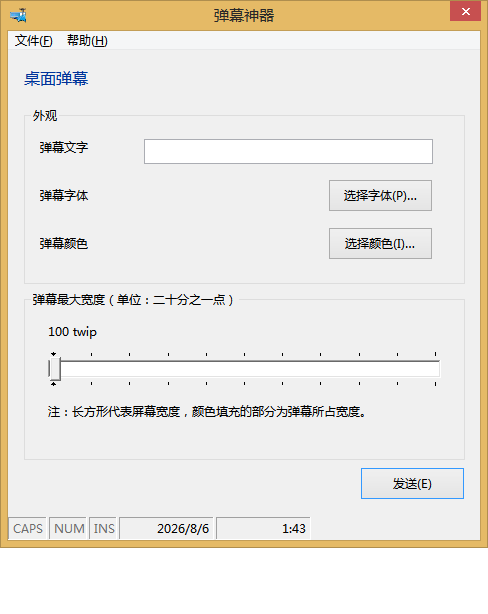
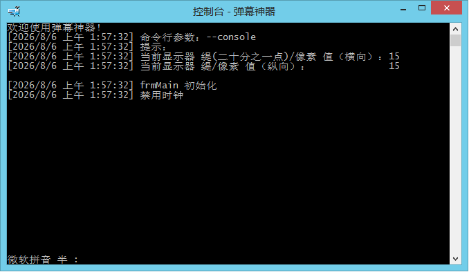

# 用 Visual Basic 写的桌面弹幕程序



## 简介

> [!NOTE]
> 该程序功能与 eDeskDanmaku 一致。请使用本项目。

你想要在桌面上拥有弹幕的体验吗？这个程序可以帮到你（虽然一次只能发一条）。

## 使用

> [!TIP]
> 不建议使用旧版本提供的单文件版。它们不包含 VB 运行时及所需的 ActiveX 控件文件，可能导致兼容性问题。

安装后即可在开始菜单找到弹幕神器，启动后即可使用。

另外，弹幕神器支持 `/C`（`--console`）命令行开关，它可以让弹幕神器具有一个控制台并输出部分信息。



## 原理

弹幕被放在一个分层窗口（`frmContainer`）的 Label 控件中，使用 <a href="https://learn.microsoft.com/zh-cn/windows/win32/api/winuser/nf-winuser-setlayeredwindowattributes" target="_blank">Win32 API `SetLayeredWindowAttributes()` 函数</a>（位于 `user32.dll`）移除了窗口背景，实现“弹幕”的效果。

```vb
Public Declare Function SetLayeredWindowAttributes Lib "user32" ( _
    ByVal hWnd As Long, _
    ByVal crKey As Long, _
    ByVal bAlph As Byte, _
    ByVal dwFlags As Long) As Long
```

## 系统要求

建议在 Windows Vista 以上系统运行。
- **最低系统**：Windows 2000

<!--
## 编译

### 1. 克隆本仓库

确保你安装了 git，然后执行以下命令：
```batch
git clone https://github.com/wsrj/desk-danmaku-vb.git
```
或者从发行页面下载“Source Code”压缩包。

### 2. 编译工程

打开 Visual Basic 6.0，单击“文件”\“打开”，导航到克隆项目的目录，选择“`弹幕神器.vbp`”并打开。
单击“文件”\“生成`弹幕神器.exe`”，选择保存位置，稍等片刻即可。


### 3. 打包工程

打开开始菜单中的“Package & Deployment 向导”，选择刚才的工程文件，单击左侧的“打包”，向导会带你打包所需运行库和 OCX 组件等。


-->